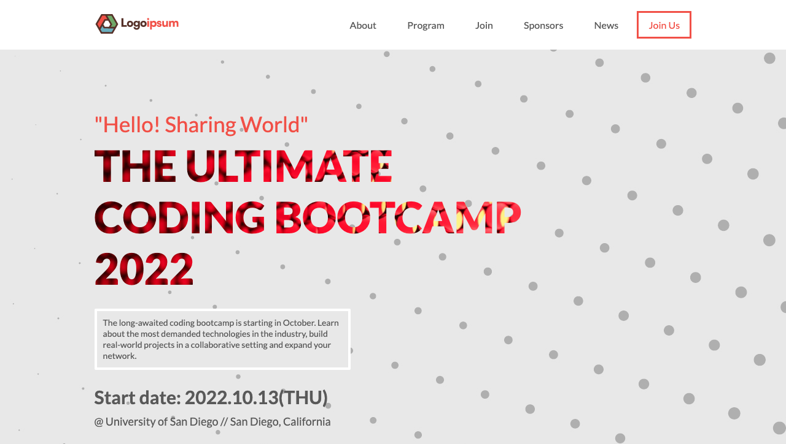

# Project Name

> Conference webpage mockup. Made for the first capstone project of Microverse.

## Built With

- HTML
- CSS
- JavaScript

## Live Demo

Live demo hosted on GitHub Pages // [Live Demo Link](https://piero-vic.github.io/conference-website/)

## Author(s)

👤 **Piero Lescano**

- GitHub: [@piero-vic](https://github.com/piero-vic)
- Twitter: [@v1ccenzo](https://twitter.com/v1ccenzo)
- LinkedIn: [piero-lescano](https://linkedin.com/in/piero-lescano)

## Show your support

Give a ⭐️ if you like this project!

## Acknowledgments

- [Original design idea](https://www.behance.net/gallery/29845175/CC-Global-Summit-2015) by [Cindy Shin in Behance](https://www.behance.net/adagio07).
- Speakers photos are from [Random User Generator](https://randomuser.me/)
- Hero background vector created by starline - [www.freepik.com](https://www.freepik.com)
- Placeholder logos are from [Logoipsum](https://logoipsum.com/)
- Social media icons are from [Bootstrap Icons](https://icons.getbootstrap.com/)
